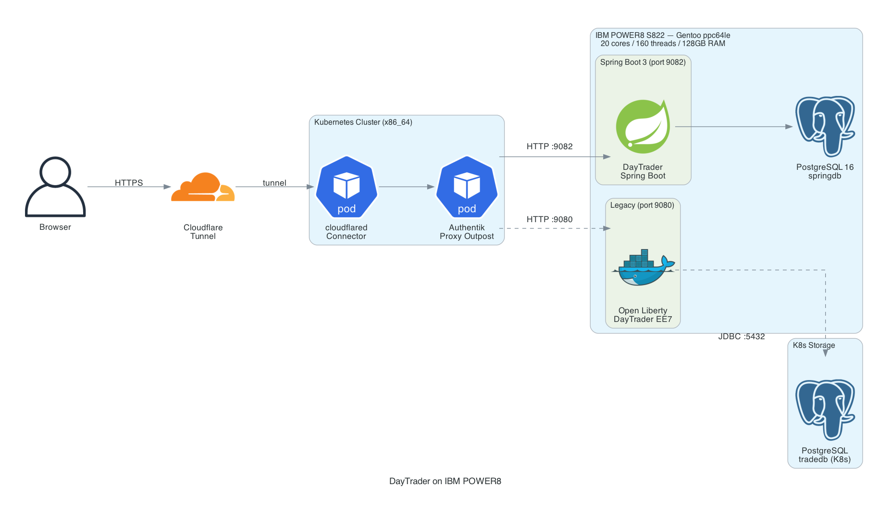

# DayTrader 7 → Spring Boot — Enterprise Java on IBM POWER8

[](https://github.com/felipedbene/sample.daytrader7/actions/workflows/deploy.yml)

A complete rewrite of IBM's [DayTrader 7](https://github.com/WASdev/sample.daytrader7) benchmark from Java EE 7 / EJB to **Spring Boot 3**, running on bare-metal **IBM POWER8 (ppc64le)** with PostgreSQL 16.

📝 **Blog post:** [DayTrader, AIX, and Knowing When to Pivot](https://wordpress.debene.dev/2026/02/26/aix-power8-daytrader-modernization/)

## What Changed

| | Original (Java EE 7) | This Rewrite (Spring Boot 3) |
|---|---|---|
| **Framework** | EJB 3.2 / JSF 2.3 / JPA 2.2 | Spring Boot 3 / Thymeleaf / Spring Data JPA |
| **Runtime** | WebSphere Liberty / OpenJ9 | JDK 21 (Temurin) |
| **Database** | Embedded Derby | PostgreSQL 16 |
| **UI** | JSP framesets + Dojo Toolkit | Thymeleaf + HTMX (vanilla JS polling) |
| **Auth** | None / container-managed | Spring Security + Authentik SSO |
| **Real-time** | WebSocket (Dojo) | HTMX `fetch()` polling every 10s |
| **Build** | Maven multi-module EAR | Maven single JAR |
| **Deploy** | Manual scp | GitHub Actions CI/CD |
| **Infra** | WebSphere on x86 | Bare-metal POWER8 (Gentoo ppc64le) |

## Architecture




```
Internet → Cloudflare Tunnel → Authentik Proxy (K8s) → IBM POWER8 S822
                                                         ├── Spring Boot 3 (JDK 21)
                                                         │   ├── Thymeleaf + HTMX UI
                                                         │   ├── Spring Data JPA
                                                         │   ├── Spring Security
                                                         │   └── Market Summary (scheduled)
                                                         └── PostgreSQL 16 (baremetal)
                                                              └── springdb (15K users, 10K quotes)
```

| Component | Details |
|-----------|---------|
| **Hardware** | IBM S822 — Dual POWER8, 20 cores / 160 threads (SMT8), 128GB RAM |
| **OS** | Gentoo Linux ppc64le, kernel 6.17.x |
| **JDK** | Eclipse Temurin 21 (ppc64le) |
| **Database** | PostgreSQL 16.12 (baremetal, same host) |
| **Auth** | Authentik Proxy Outpost (external, K8s) |
| **CI/CD** | GitHub Actions → self-hosted runner → SSH deploy |
| **Migrations** | Flyway |

## Project Structure

```
├── daytrader-ee7/                  # Original Java EE 7 app (Liberty EAR)
├── daytrader-ee7-ejb/              # Original EJBs, JPA entities
├── daytrader-ee7-web/              # Original JSP/JSF web layer
│
├── daytrader-spring/               # ⭐ Spring Boot rewrite
│   ├── src/main/java/com/ibm/daytrader/
│   │   ├── config/                 # Security, WebSocket, properties
│   │   ├── entity/                 # JPA entities (reused schema)
│   │   ├── repository/             # Spring Data JPA repositories
│   │   ├── service/                # Trade, MarketSummary, DatabaseInit
│   │   ├── web/controller/         # Thymeleaf MVC controllers
│   │   ├── dto/                    # Market summary, price DTOs
│   │   └── event/                  # Order/price change events
│   ├── src/main/resources/
│   │   ├── application-prod.yml    # Production config
│   │   └── templates/              # Thymeleaf templates
│   ├── Dockerfile                  # JDK 21 ppc64le image
│   └── docker-compose.prod.yml     # Production deployment
│
├── .github/workflows/deploy.yml    # CI/CD pipeline
└── Dockerfile                      # Legacy Liberty image
```

## Quick Start

### Run locally

```bash
cd daytrader-spring
./mvnw spring-boot:run -Dspring-boot.run.profiles=dev
```

### Production (POWER8)

```bash
cd daytrader-spring
./mvnw clean package -DskipTests
docker compose -f docker-compose.prod.yml up -d --build
```

Or just push to `master` — GitHub Actions handles the rest.

### Seed the database

First login creates the schema (Flyway). The app auto-seeds 15K users + 10K quotes on startup via `DatabaseInitService`.

## Load Testing

```bash
# 15K users × 5 buy+sell trades, 20 concurrent sessions
# Result: ~157 trades/sec on POWER8
bash load-test.sh
```

## CI/CD Pipeline

```
Push to master → GitHub Actions (self-hosted runner)
                    │
                    ├── Build: Maven package (JDK 21)
                    │
                    └── Deploy: SSH into P8 (ppc64le)
                         ├── git pull
                         ├── mvnw package (rebuilds on POWER8)
                         ├── pkill old process
                         ├── java -jar ... (baremetal, no container)
                         └── Health check + Discord notification
```

**Why this works:** Java bytecode is platform-independent. The same `.jar` runs on x86_64 and ppc64le without recompilation. In practice, we rebuild on P8 to ensure native dependencies (if any) match, but the Maven artifacts are identical. This is the original promise of "write once, run anywhere" — finally delivering in 2026 on hardware IBM shipped in 2014.

**No Docker in production.** The Spring Boot app runs directly on the JVM (Eclipse Temurin 21 on Gentoo ppc64le). Docker images exist for portability and are published to `ghcr.io/felipedbene/sample.daytrader7`, but the P8 production deployment is bare-metal Java — faster startup, lower overhead, full access to all 160 threads.

## The Journey

This project went through three distinct phases:

1. **AIX KVM** — Got DayTrader running on AIX 7.2 inside a KVM VM on POWER8. Monkey-patched Python, nuked OpenSSL, survived.

2. **Liberty + REST APIs** — Bolted JAX-RS endpoints onto the Java EE 7 app. 34 commits of chaos. PostgreSQL migration. OIDC auth loop from hell behind Cloudflare Tunnel. Docker Compose on ppc64le.

3. **Spring Boot rewrite** — Archived `daytrader-modern`, came back to this repo, built a proper Spring Boot 3 app with Thymeleaf + HTMX. Same domain model, modern stack. Everything works.

Full story: [DayTrader, AIX, and Knowing When to Pivot](https://wordpress.debene.dev/2026/02/26/aix-power8-daytrader-modernization/)

## Why POWER8?

Because running enterprise Java on a 20-core / 160-thread IBM POWER8 in a homelab is more fun than yet another x86 deployment. And because sometimes you need to prove that a 2005 benchmark can be modernized and deployed on hardware IBM itself would raise an eyebrow at.

## Credits

- Original DayTrader by IBM — [WASdev/sample.daytrader7](https://github.com/WASdev/sample.daytrader7)
- Infrastructure managed by [Garra De Baitola](https://github.com/openclaw/openclaw) 🦞

## License

Apache License 2.0 — see [LICENSE](LICENSE)
